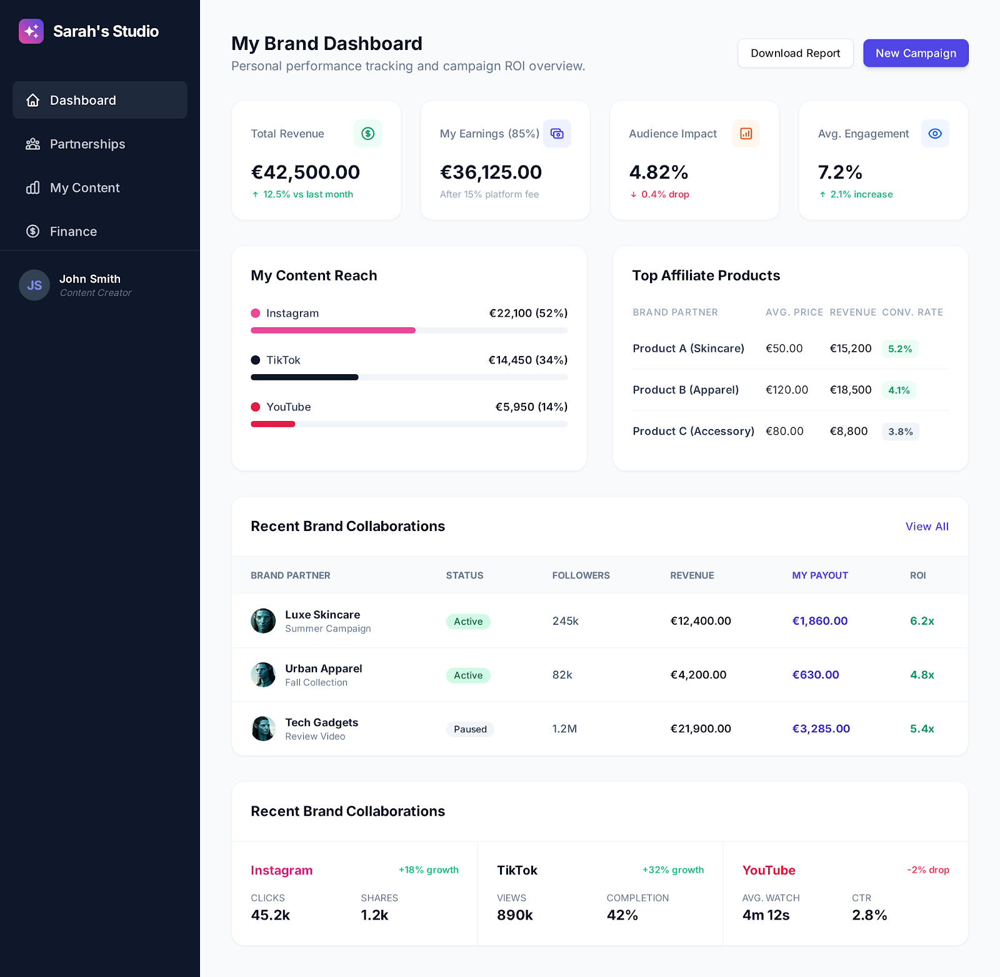

<div align="center">
  
</div> 
</br>

# 🎯 Reto: Un dashboard sencillo en Tailwind CSS
<div align="center">
  
</div> 
</br>

Una influencer que está empezando a relacionarse con marcas te contacta porque necesita medir el impacto de sus anuncios y su conversión. El problema es que tiene múltiples cuentas en redes sociales (Instagram, TikTok, YouTube, etc.) y necesita entender cómo puede consolidar toda la información en un tablero de reporte para responder preguntas básicas como:
- ¿Cuánto dinero estoy generando en comisiones?
- ¿Qué productos están generando más ingresos?
- ¿Qué tan bien convierten mis anuncios (conversiones / alcance)?
- ¿Qué plataformas están generando mejor retorno (ingresos/costes)?
- ¿Cuál es el engagement rate por plataforma y por producto?

La influencer te contacta porque necesita un reporte claro (un dashboard) que le permita supervisar su negocio sin perderse en datos dispersos entre múltiples plataformas. Y tú, aunque estás empezando, quieres entregar una propuesta sólida y profesional, así que tu misión es diseñar un dashboard que consolide la información de todas sus redes sociales y le muestre lo más importante para tomar decisiones rápidas.

Contexto del negocio:
- Tiene 3 productos que promociona con tres precios distintos (Producto A: 50€, Producto B: 120 €, Producto C: 80 €)
- Por cada venta generada recibe una comisión del 15%

## Instalación
Para levantar el servidor ejecuta el siguiente comando: 
```bash
$ pip3 install flask && python3 server.py
```
